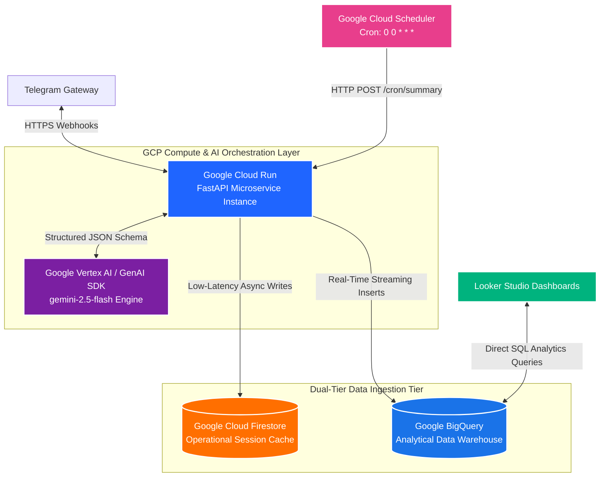
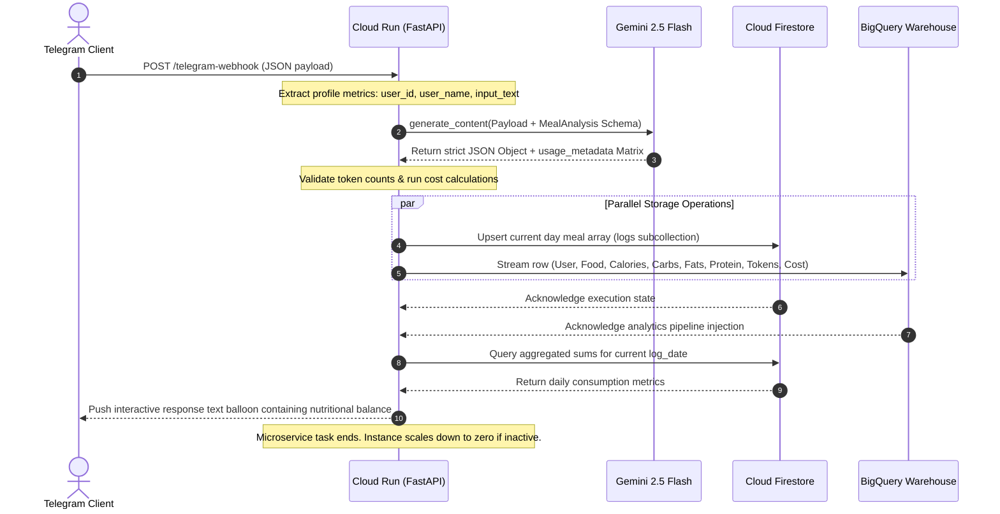

```markdown
# <span style="color:#1f65ff">System Design Document: Personal Dietitian Bot (Version 2.0)</span>

## <span style="color:#00b37e">1. High-Level Serverless Architecture</span>
Version 2.0 is an asynchronous, event-driven microservice engineered using a stateless cloud-native pattern. Rather than relying on a persistent background long-polling loop, the backend scales on-demand via webhooks hosted within an edge-optimized container environment.



---

## 2. Google Cloud Platform Component Matrix

| Component | Architecture Role | Strategic Selection Driver |
| --- | --- | --- |
| **Google Cloud Run** | Scalable Stateless Container Host | Implements dynamic `scale-to-zero` scaling rules. Eliminates compute runtime costs entirely when the application is idle. |
| **FastAPI Webhook Gateway** | Edge Message Router Engine | Replaces traditional polling. Eliminates long-running execution blockages and safely splits on-demand requests vs cron requests. |
| **Google Cloud Firestore** | Operational Document Caching Layer | Serverless NoSQL structure optimized for rapid, real-time key-value mutations. Powers daily status and summary lookups. |
| **Google BigQuery** | Enterprise Analytical Warehouse | Dedicated long-term persistence node. Automatically scales to hold years of metrics without hitting database size barriers. |
| **Google Cloud Scheduler** | Serverless Unified Cron Engine | Handles precise time-based operations. Fires a programmatic trigger exactly at midnight to execute automated client summary rollups. |

---

## 3. Core Data Processing Flow

The transactional sequence map below illustrates how an incoming user event triggers structural data expansion, dual-tier ingestion splits, token harvesting, and immediate compute-termination.



---

## 4. Database & Storage Architecture

### 4.1 Operational Tier Schema: Google Cloud Firestore

Data is managed using high-level root documents containing transactional nested subcollections grouped by target date boundaries.

```
📁 users (Collection)
  └── 📄 {user_id} (Document)
        ├── 🔹 user_name: "Pushpam Kumar"
        ├── 🔹 daily_target: 1500
        └── 📁 logs (Subcollection)
              └── 📄 {auto_generated_log_id} (Document)
                    ├── 🔹 log_date: "2026-05-28"
                    ├── 🔹 time: "14:23"
                    ├── 🔹 food: "Grilled Salmon Salad"
                    ├── 🔹 calories: 420
                    ├── 🔹 carbs: 12
                    ├── 🔹 fats: 22
                    └── 🔹 protein: 44

```

### 4.2 Analytical Warehouse Schema: Google BigQuery

The long-term log table uses a flat schema optimization designed for long-term storage and analytical dashboard rendering.

* **Partition Strategy:** `TIMESTAMP_TRUNC(timestamp, DAY)`

| Column Field Name | Data Target Type | Mode Configuration | Architectural Purpose |
| --- | --- | --- | --- |
| `user_id` | `STRING` | REQUIRED | Telegram persistent routing key mapping. |
| `user_name` | `STRING` | NULLABLE | Display name captured during message ingestion. |
| `timestamp` | `TIMESTAMP` | REQUIRED | Epoch execution timeline tracking index. |
| `food_item` | `STRING` | NULLABLE | AI-extracted target food item signature text. |
| `calories` | `INTEGER` | NULLABLE | Measured energy metrics in kcal. |
| `carbs` | `INTEGER` | NULLABLE | Carbohydrates calculated value in grams. |
| `fats` | `INTEGER` | NULLABLE | Lipid fats calculated value in grams. |
| `protein` | `INTEGER` | NULLABLE | Protein calculated value in grams. |
| `prompt_tokens` | `INTEGER` | REQUIRED | Core input prompt payload tokens processed. |
| `completion_tokens` | `INTEGER` | REQUIRED | Response JSON text block tokens generated. |
| `total_tokens` | `INTEGER` | REQUIRED | Operational aggregate volume ($Prompt + Completion$). |
| `calculated_cost_usd` | `FLOAT` | REQUIRED | Calculated micro-dollar transactional API cost. |

---

## 5. Token Metrics & Transaction Cost Evaluation Matrix

To monitor billing metrics at a granular level, the execution engine tracks consumption using the official model pricing constants.

### 5.1 Pricing Matrix Setup

The application maps token usage directly to current API parameters:

* **Input Rate:** $0.30 per 1,000,000 tokens ($0.00000030 per token)
* **Output Rate:** $2.50 per 1,000,000 tokens ($0.00000250 per token)

### 5.2 Cost Calculation Engine Workflow

Every transaction automatically applies the following mathematical evaluation inside the Cloud Run worker block before pushing data to the warehouse pipeline:

$$\text{Calculated Cost (USD)} = (\text{prompt\_tokens} \times 0.00000030) + (\text{completion\_tokens} \times 0.00000250)$$

This transactional logging model lets you instantly see your total financial run-rate across days, weeks, or individual users by running simple SQL queries in BigQuery.

---

## 6. Cost Efficiency & Serverless Configuration Baseline

To guarantee the system achieves your cost optimization goals, your deployment configurations must strictly implement the following rules:

* **Scale-to-Zero Guardrail:** The Cloud Run instance profile must enforce a configuration minimum of `min-instances = 0`. If no user interacts with the system for an extended period, the environment automatically tears down all compute allocations, dropping your infrastructure run-rate down to exactly **$0.00**.
* **Stateless Memory Profile:** Because binary media structures are processed in-memory as variable-length bytes rather than being cached locally to disk, Cloud Run instances can spin down immediately after returning a webhook response, completely avoiding memory-leak billing inflation.

```

```
